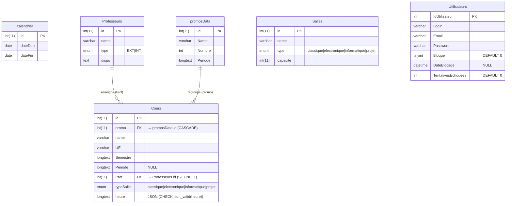

# OPALE PROJECT

## To run the project : 

### 1. Database

* Prerequisite : [Docker](https://www.docker.com/get-started/) is installed.
* Open terminal in folder BobPlanning.database
* `docker compose up`

* Add a file .env at the root of the project that contains this :

```
  MYSQL_ROOT_PASSWORD=rootpassword
  MYSQL_DATABASE=bobPlanning
  MYSQL_USER=bob
  MYSQL_PASSWORD=thisIsBobPlanning!
  MYSQL_ROOT_HOST=%
  MYSQL_INITDB_SKIP_TZINFO=1
  MYSQL_TCP_PORT=3306
  MYSQL_WAIT_TIMEOUT=28800
  MYSQL_INTERACTIVE_TIMEOUT=28800
```

### 2. Backend
Add file `db.conf` in src/database/config
```
    DB_HOST=localhost
    DB_USER=bob
    DB_PASSWORD=thisIsBobPlanning!
    DB_NAME=planning
    DB_PORT=3306
    
    
    MYSQL_ROOT_PASSWORD=rootpassword 
    MYSQL_DATABASE=bobPlanning 
    MYSQL_USER=bob 
    MYSQL_PASSWORD=thisIsBobPlanning! 
    MYSQL_ROOT_HOST=% 
    MYSQL_INITDB_SKIP_TZINFO=1 
    MYSQL_TCP_PORT=3306 
    MYSQL_WAIT_TIMEOUT=28800 
    MYSQL_INTERACTIVE_TIMEOUT=28800 
```
* Go to BobPlanning.back --> cd .\BobPlanning.back
* Install library --> npm i
* Run the project --> npm run dev

### 3. Frontend
 
* Add this .env file in BobPlanning.front :

```
  VITE_RACINE_FETCHER_URL=http://localhost:3000
```
* Go to BobPlanning.front --> cd .\BobPlanning.front
* Install library --> npm i
* Run the project --> npm run dev 


You can stop here if you just want to run the project. Continue if you are trying to develop.

---

 Pour l'utilisation de le partie, utilisation de postman en rajoutant dans le headers un x-access-token que vous pouvez le récupérer depuis votre front apres la connexion en tapant dans votre console web la commande : localStorage.accessToken qui vous renvoit votre token actuel. 
 Sinon vous pouvez supprimer dans index.ts la demande de vérification du token, attention, ne pas supprimer pour la partie prod. 

## [work in progress] MicroService
Service pour générer le micro-planning
 Go to BobPlanning.microService --> cd .\BobPlanning.microService
 Create a env mode for python --> python -m venv venv
 Go in env mode for python : 
   If you are a linux user --> source venv/bin/activate 
   If you are a Windows user --> .\venv\Scripts\activate
 Install library --> pip install -r requirements.txt
 Run the project --> uvicorn main:app --port 3001 --reload

 Pour mettre à jour les installations de lib --> pip freeze > requirements.txt

## Database
### Entity Relationship Diagram 
#### Existing Database Schema : BOB

