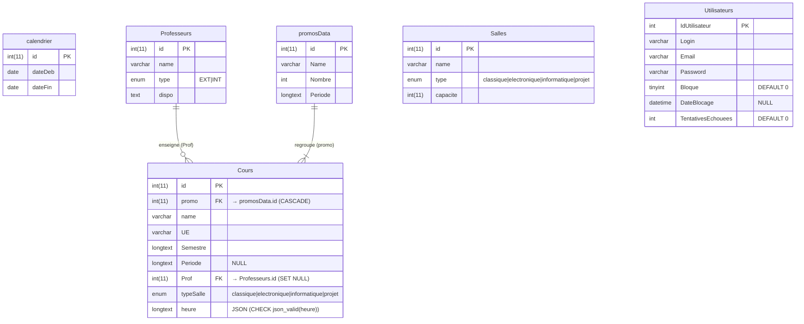
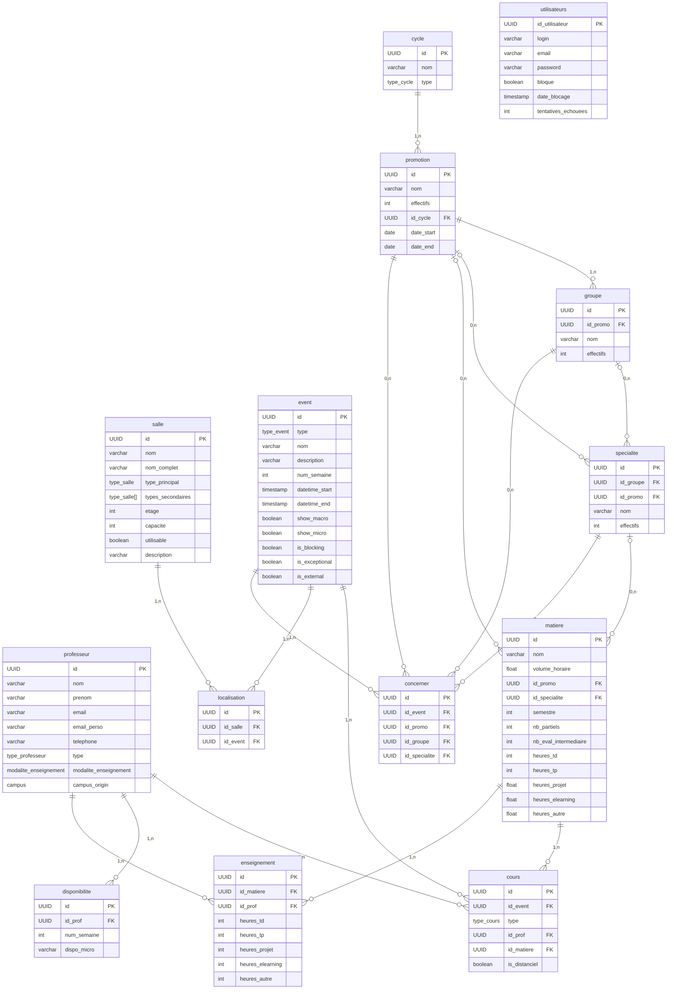

# 💎 OPALE PROJECT
## 📖 Presentation
OPALE is a legacy project that helps JUNIA coordinators manage academic planning. 

It provides a complete solution to schedule and organize professors, students, and classrooms. The project is built around three main components: the database, the backend, and the frontend.

- The database stores all planning-related data, including schedules, professors, students, and rooms.
- The backend contains the business logic. It processes requests, applies the necessary rules, and communicates with the database.
- The frontend provides the user interface, allowing coordinators and other users to interact easily with the system.


## 📗 Run the project

### 1. Database

- Prerequisite: [Docker](https://www.docker.com/get-started/) is installed.
- Add this `.env` file in `BobPlanning.database`:
```env
POSTGRES_DB=opale
POSTGRES_USER=opale_user
POSTGRES_PASSWORD=thisIsOpale!
```

### 2. Backend
- Create `BobPlanning.back/src/database/config` directory.
- Add this `db.conf` file in `BobPlanning.back/src/database/config` :
```env
DB_HOST=localhost
DB_USER=opale_user
DB_PASSWORD=thisIsOpale!
DB_NAME=opale
DB_PORT=5432
POSTGRES_DB=opale
POSTGRES_USER=opale_user
POSTGRES_PASSWORD=thisIsOpale!
```
- Add this `.env` file in `BobPlanning.back`:
```env
DB_HOST=localhost
DB_PORT=5432
DB_NAME=opale
DB_USER=opale_user
DB_PASSWORD=thisIsOpale!
```
- Go to `BobPlanning.back` → `cd .\BobPlanning.back`
- Install library → `npm i`

### 3. Frontend
- Add this `.env` file in `Opale.Front`:
```env
VITE_RACINE_FETCHER_URL=http://localhost:3000
```
- Go to `Opale.Front` → `cd .\Opale.Front`
- Install library → `npm i`


### 4. Global projet
- Add this `.env` file in `OPALE`:
```env
POSTGRES_DB=opale
POSTGRES_USER=opale_user
POSTGRES_PASSWORD=thisIsOpale!
VITE_RACINE_FETCHER_URL=http://localhost:3000/
```
- Go to `OPALE` → `cd .\OPALE`

### 5. Run
- Run the project → `docker compose up --build` (NB : write `docker compose up` if you have already built the project before)
- The backend will be available at `http://localhost:3000` and the frontend at `http://localhost:5173`.

You can stop here if you just want to run the project. Continue if you are trying to develop.

---
## 📘Database

### Entity Relationship Diagram

#### Existing Database Schema: BOB

```mermaid
erDiagram
%% =====================
%% Schéma : bobPlanning
%% =====================

    calendrier {
        int(11) id PK
        date dateDeb
        date dateFin
    }

    Cours {
        int(11) id PK
        int(11) promo FK  "→ promosData.id (CASCADE)"
        varchar name
        varchar UE
        longtext Semestre
        longtext Periode  "NULL"
        int(11) Prof FK       "→ Professeurs.id (SET NULL)"
        enum typeSalle    "classique|electronique|informatique|projet"
        longtext heure    "JSON (CHECK json_valid(heure))"
    }

    Professeurs {
        int(11) id PK
        varchar name
        enum type         "EXT|INT"
        text dispo        
    }

    promosData {
        int(11) id PK
        varchar Name
        int Nombre
        longtext Periode  
    }

    Salles {
        int(11) id PK
        varchar name
        enum type         "classique|electronique|informatique|projet"
        int(11) capacite
    }

    Utilisateurs {
        int IdUtilisateur PK
        varchar Login
        varchar Email
        varchar Password
        tinyint Bloque        "DEFAULT 0"
        datetime DateBlocage  "NULL"
        int TentativesEchouees "DEFAULT 0"
    }

%% =====================
%% Relations
%% =====================

    Professeurs ||--o{ Cours : "enseigne (Prof)"
    promosData  ||--|{ Cours : "regroupe (promo)"
%% Note: pas de contrainte FK entre Cours.typeSalle et Salles
%% Note: calendrier et Utilisateurs n'ont pas de relations explicites

```

#### New Database Schema: OPALE

For a better understanding of the new database schema, we can refer to the following Entity Relationship Diagram (ERD) which illustrates the entities and their relationships in the OPALE project:


```mermaid
erDiagram
    professeur {
        UUID id PK
        varchar nom
        varchar prenom
        varchar email
        varchar email_perso
        varchar telephone
        type_professeur type
        modalite_enseignement modalite_enseignement
        campus campus_origin
    }

    salle {
        UUID id PK
        varchar nom
        varchar nom_complet
        type_salle type_principal
        type_salle[] types_secondaires
        int etage
        int capacite
        boolean utilisable
        varchar description
    }

    event {
        UUID id PK
        type_event type
        varchar nom
        varchar description
        int num_semaine
        timestamp datetime_start
        timestamp datetime_end
        boolean show_macro
        boolean show_micro
        boolean is_blocking
        boolean is_exceptional
        boolean is_external
    }

    cycle {
        UUID id PK
        varchar nom
        type_cycle type
    }

    promotion {
        UUID id PK
        varchar nom
        int effectifs
        UUID id_cycle FK
        date date_start
        date date_end
    }

    groupe {
        UUID id PK
        UUID id_promo FK
        varchar nom
        int effectifs
    }

    specialite {
        UUID id PK
        UUID id_groupe FK
        UUID id_promo FK
        varchar nom
        int effectifs
    }

    matiere {
        UUID id PK
        varchar nom
        float volume_horaire
        UUID id_promo FK
        UUID id_specialite FK
        int semestre
        int nb_partiels
        int nb_eval_intermediaire
        int heures_td
        int heures_tp
        float heures_projet
        float heures_elearning
        float heures_autre
    }

    cours {
        UUID id PK
        UUID id_event FK
        type_cours type
        UUID id_prof FK
        UUID id_matiere FK
        boolean is_distanciel
    }

    disponibilite {
        UUID id PK
        UUID id_prof FK
        int num_semaine
        varchar dispo_micro
    }

    localisation {
        UUID id PK
        UUID id_salle FK
        UUID id_event FK
    }

    concerner {
        UUID id PK
        UUID id_event FK
        UUID id_promo FK
        UUID id_groupe FK
        UUID id_specialite FK
    }

    enseignement {
        UUID id PK
        UUID id_matiere FK
        UUID id_prof FK
        int heures_td
        int heures_tp
        int heures_projet
        int heures_elearning
        int heures_autre
    }

    utilisateurs {
        UUID id_utilisateur PK
        varchar login
        varchar email
        varchar password
        boolean bloque
        timestamp date_blocage
        int tentatives_echouees
    }

%% ================================
%%          RELATIONS
%% ================================

    cycle ||--o{ promotion : "1,n"

    promotion ||--o{ groupe : "1,n"
    promotion o|--o{ specialite : "0,n"
    promotion o|--o{ matiere : "0,n"

    groupe o|--o{ specialite : "0,n"

    specialite o|--o{ matiere : "0,n"

    professeur ||--o{ cours : "1,n"
    matiere ||--o{ cours : "1,n"
    event ||--o{ cours : "1,n"

    professeur ||--o{ disponibilite : "1,n"

    salle ||--o{ localisation : "1,n"
    event ||--o{ localisation : "1,n"

    event ||--o{ concerner : "1,n"
    promotion ||--o{ concerner : "0,n"
    groupe ||--o{ concerner : "0,n"
    specialite ||--o{ concerner : "0,n"

    professeur ||--o{ enseignement : "1,n"
    matiere ||--o{ enseignement : "1,n"
```

You can also follow this link, to have a better view of the database schema : [DrawSQL](https://drawsql.app/teams/opale-3/diagrams/opale-diagram?ref=embed).

You can also read the database documentation by following this link : [Confluence-BDD](https://opaleap5.atlassian.net/wiki/spaces/OPALE/pages/20611077/BDD)

## 📒API - Postman collection

You can find the postman collection by following this link : [Postman](https://www.postman.com/workspace/My-Workspace~9c5702ca-1443-400d-88e7-5bcd552db2f4/collection/24357578-08705eb3-14c9-48e6-b159-9d5d52bd1576?action=share&source=copy-link&creator=24357578).
With this collection, you can test all the API endpoints of the project, and import it to update the collection itself. Make sure to update the environment variables in postman to match your local setup (e.g., base URL, authentication tokens).
* You can show the generated doc by clicking on the "Overview" tab in the postman collection, and then click on "View complete documentation". This will open the documentation, where you can see all the endpoints, their descriptions, and how to use them.

You can also read the API documentation by following this link : [Confluence-API](https://opaleap5.atlassian.net/wiki/spaces/OPALE/pages/25264129/Routes?draftShareId=b507934e-0d8e-4893-b456-6b3c94cd13de)


### Important steps for using the API

1. **Authentication**: First, you need to authenticate to get an access token. Use the *GetAccessToken* endpoint to receive a JWT token (only run it).
2. **Set Token in Headers** : For all subsequent API requests, include the received token in the headers as `x-access-token`. This will allow you to access protected endpoints.

## 📕 [work in progress] MicroService

Service for micro-planning generation

- Go to `BobPlanning.microService` --> `cd .\BobPlanning.microService`
- Create a env mode for python --> `python -m venv venv`
- Go in env mode for python:
  - If you are a linux user --> `source venv/bin/activate`
  - If you are a Windows user --> `.\venv\Scripts\activate`
- Install library --> `pip install -r requirements.txt`
- Run the project --> `uvicorn main:app --port 3001 --reload`

For updating lib installations, you can run --> `pip freeze > requirements.txt`

## 📙 CI/CD

We have set up a CI/CD pipeline to automate the testing (and furthemore deployment) of our application.

## 📔 Sonarqube

We have integrated SonarQube into our containerized environment to ensure code quality and maintainability. SonarQube provides continuous inspection of code quality, allowing us to identify and fix issues early in the development process.

You can access the SonarQube dashboard at `http://localhost:9000` to view code quality metrics, identify bugs, vulnerabilities, and code smells. This integration helps us maintain a high standard of code quality throughout the development lifecycle.

Don't forget to get your Sonarqube token and set it in the `.env` file at the root of the project.


## 🔗 Usefull links:
- [DrawSQL](https://drawsql.app/teams/opale-3/diagrams/opale-diagram?ref=embed) : for the database schema
- [Postman](https://www.postman.com/workspace/My-Workspace~9c5702ca-1443-400d-88e7-5bcd552db2f4/collection/24357578-08705eb3-14c9-48e6-b159-9d5d52bd1576?action=share&source=copy-link&creator=24357578) : for the API collection
- [Confluence](https://opaleap5.atlassian.net/wiki/spaces/OPALE/overview?homepageId=131335) : for the project documentation
